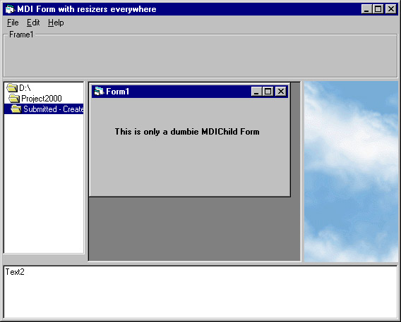



## MDI Splitters with 4 Panes

### Description

This project Shows how to create a multiple-splitted MDI parent window. This project in particular manages 4 panes. There are only 2 API functions in use too.
 
### More Info
 
Some applications use 4 or 3 pane MDI windows, this demonstrates how to resize these panes.

             |
---                |---
**Submitted On**   |2000-06-29 02:05:38
**By**             |[Edward L\. Blake](https://github.com/Planet-Source-Code/PSCIndex/blob/master/ByAuthor/edward-l-blake.md)
**Level**          |Intermediate
**User Rating**    |4.5 (18 globes from 4 users)
**Compatibility**  |VB 3\.0, VB 4\.0 \(16\-bit\), VB 4\.0 \(32\-bit\), VB 5\.0, VB 6\.0, VB Script, ASP \(Active Server Pages\) 
**Category**       |[Custom Controls/ Forms/  Menus](https://github.com/Planet-Source-Code/PSCIndex/blob/master/ByCategory/custom-controls-forms-menus__1-4.md)
**World**          |[Visual Basic](https://github.com/Planet-Source-Code/PSCIndex/blob/master/ByWorld/visual-basic.md)
**Archive File**   |[CODE\_UPLOAD72696292000\.zip](https://github.com/Planet-Source-Code/edward-l-blake-mdi-splitters-with-4-panes__1-9364/archive/master.zip)

